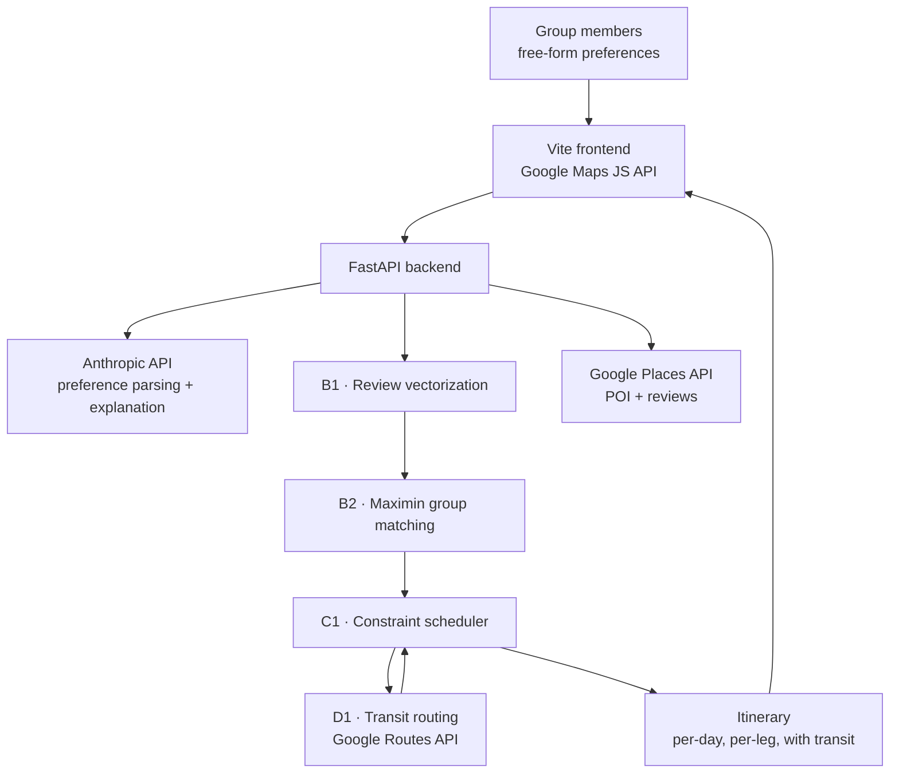

# KUAWS — AI Group Travel Planner (Case Study)

**Korea University × AWS AI Innovators Challenge 2026** · 5-person team · **My role: team lead & backend**

Planning a trip alone is a search problem. Planning one for five people is a *negotiation* problem, and every travel app on the market quietly solves the first one and hands you the second. KUAWS is our attempt at the second: take a group's conflicting preferences, and produce one itinerary that nobody in the group hates — with real transit times attached, not straight-line distances.

> **Why this repository has no code.** The implementation lives in a private team repository. This is a written case study of the system and of the parts I personally owned: architecture, decisions, trade-offs, and what broke. Happy to walk through the source directly on request.

---

## The problem

Give five people a destination and a weekend. Ask each of them what they want. You now have:

- **Conflicting preferences.** Averaging them produces an itinerary optimized for a person who does not exist — the mean of "museums" and "nightlife" is a day nobody asked for.
- **Hard constraints that averaging ignores.** Opening hours, travel time between stops, a fixed dinner reservation, one person who cannot walk 8km a day.
- **Distances that lie.** Two points 2km apart can be 12 minutes or 50 minutes apart depending on whether a subway line connects them.

## What we built

Four modules we treated as non-negotiable, because they are the entire difference between this and a chatbot that writes a plausible-sounding itinerary:

| Module | What it does | Why it matters |
|---|---|---|
| **B1 — Review vectorization** | Embeds POI reviews into a preference space | Lets "quiet places with good coffee" match a venue nobody tagged that way |
| **B2 — Maximin group matching** | Maximizes the *least satisfied* member's score, not the average | An itinerary the group accepts, instead of one it tolerates |
| **C1 — Constraint scheduler** | Places selected POIs into a day respecting hours, durations and travel time | Turns a ranked list into a plan that is physically possible |
| **D1 — Real transit routing** | Google Routes API for actual public-transit legs | An itinerary with honest travel times, not optimistic ones |

The LLM sits around this core — interpreting free-form preferences on the way in, explaining the plan on the way out. It does not decide the itinerary. That was a deliberate line: the parts of this problem with a correct answer are solved by an optimizer, and the parts with no correct answer are handled by a model.

## Architecture

**Stack** — FastAPI (backend) · Vite (frontend) · Anthropic API (runtime LLM) · Google Routes / Places / Maps JavaScript API · AWS (deployment target) · Kiro IDE for team-shared AI coding context

## Team

Five students from Korea University. Published with each member's consent.

| Member | Role |
|---|---|
| **Gijun Lee (이기준)** | Team lead · backend infrastructure, interface contract, cloud & API provisioning, vertical slice |
| **Seongmin Hong (홍성민)** | Backend / AI lead · B2 maximin group matching, C1 constraint scheduler, `schemas.py` interface contract |
| **Jaeyong Lee (이재용)** | — |
| **Yongjun Heo (허용준)** | — |
| **Boxiang Hou (후보향)** | — |

The four core modules were deliberately assigned as whole vertical slices rather than split by layer, so each person owned a decision surface rather than a set of functions.

## What I owned

As team lead and backend engineer on a 5-person team:

- **The vertical slice first.** Before anyone built a module properly, I built one thin end-to-end path — preference in, itinerary out, every stage stubbed but connected. It is the cheapest way to find out that two people disagree about what a "plan" is.
- **The interface contract.** A single shared `schemas.py` defining every module boundary, frozen on a fixed date. Four people writing four modules against stubs only works if the stubs are the contract, and the contract is dated.
- **Cloud and cost infrastructure.** Billing account, budget alerts, IAM for all five members, and a split API-key strategy: a backend key restricted by IP for Routes/Places, a separate frontend key restricted by HTTP referrer for Maps JS. Keys ship via `.env` and are never committed.
- **LLM provisioning.** The runtime model runs on the Anthropic API with a spend limit set before team distribution — because the failure mode of a shared key in a hackathon is not a security breach, it is a surprise invoice.
- **Team process.** Gate-based checkpoints (interface contract → tagged review → end-to-end integration) rather than a feature list, so integration risk surfaced early instead of on the last night.

## Decisions & trade-offs

**Maximin over average utility.** Maximizing average satisfaction lets the optimizer sacrifice one person entirely for a better mean. Maximin optimizes the worst-off member — mathematically weaker, socially correct. A group plan's real success metric is whether anybody refuses to go.

**Migrated routing from ODsay to Google Routes API.** Cost, coverage and a single-vendor surface for Places, Maps and Routes outweighed the rework. Migrating a dependency in week two is cheap; migrating it in week five is the project.

**Kept the LLM off the optimization path.** A model can write an itinerary that reads beautifully and puts a museum visit an hour after closing. Constraints go to a solver; language goes to the model.

**`.kiro/` committed to git.** Steering docs, specs and hooks for the AI-assisted IDE live in the repository, so the team's AI context is shared and reviewable like any other code.

## What broke, and what I learned

- **Commit attribution.** Contributions were landing under a shared "Team" identity because nobody had set `git config user.name` locally. Individual contribution was part of the evaluation, and history is expensive to rewrite. It is now the first line of the team setup doc. The lesson generalizes: on a shared project, verify what the tooling records about *who did what* before you need it.
- **"LLM credits provided" needed reading twice.** The tokens offered to participants were for the AI coding IDE, not for service runtime — so the runtime model was a decision we still had to make and pay for. I confirmed this with the organizers rather than assuming, which changed our provisioning plan entirely.
- **A frozen interface is worth more than a good one.** Our `schemas.py` is not the design I would choose today. It let four people work in parallel for three weeks, which the better design, still under discussion, would not have.

## Timeline

| Date | Milestone |
|---|---|
| Sep 6 | `schemas.py` interface contract frozen |
| Sep 12 | Tagged review checkpoint |
| Sep 20 | End-to-end integration milestone |
| Sep 29 | Preliminary round submission |
| Oct 3 | Finals |

---

**Gijun Lee (이기준)** · Electrical & Electronic Engineering, Korea University · pongdangcoo@naver.com
# kuaws-case-study
Case study: AI group travel planner for the Korea University x AWS AI Innovators Challenge — architecture, decisions, and my role as team lead
